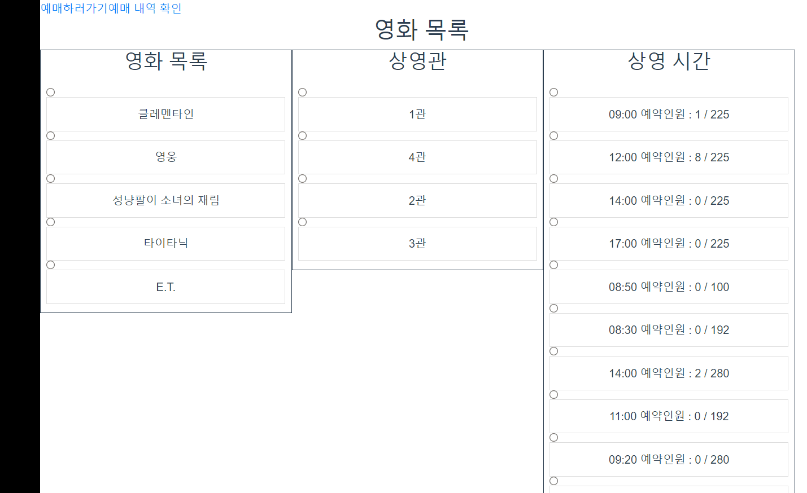
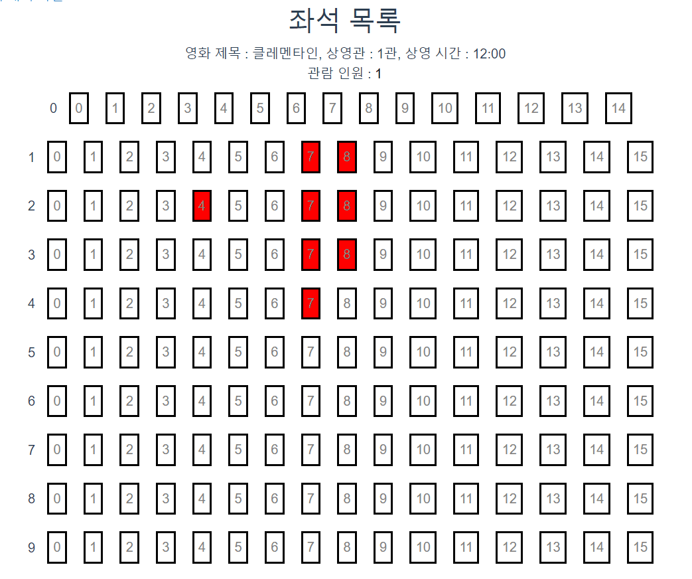
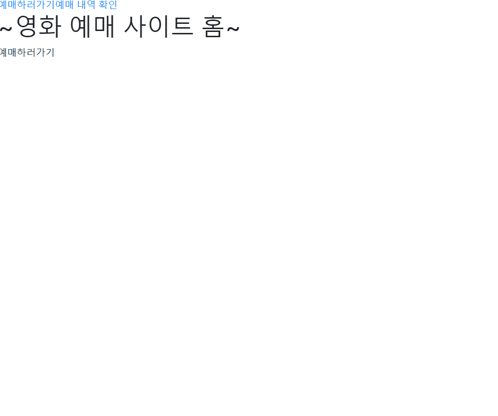

# tsis 신입사원 2차 기술교육 2주차과제

- **과제명?** 영화 예매 사이트 개발 
- **기반 기술?** Vue.js + HTML + JavaScript + Spring + Java + Mysql 

 

### 👉 산출물
- [ERD](assets/erd.JPG)
- [DB스키마(엑셀)](산출물/schema.csv)
- [war](산출물/MovieYeme-0.0.1-SNAPSHOT.war)
- [DB dump](산출물/db-Dump20210428/)

### 🎞 화면 캡쳐
**화면1 : 상영관/상영작/상영시간 선택, 전체 좌석 및 남은 좌석 표기**

**화면2 : 관람인원/좌석 선택**

**화면3 : 예매 확인 및 예매 **

**화면4 : 전화번호로 예매 내역 확인 **

